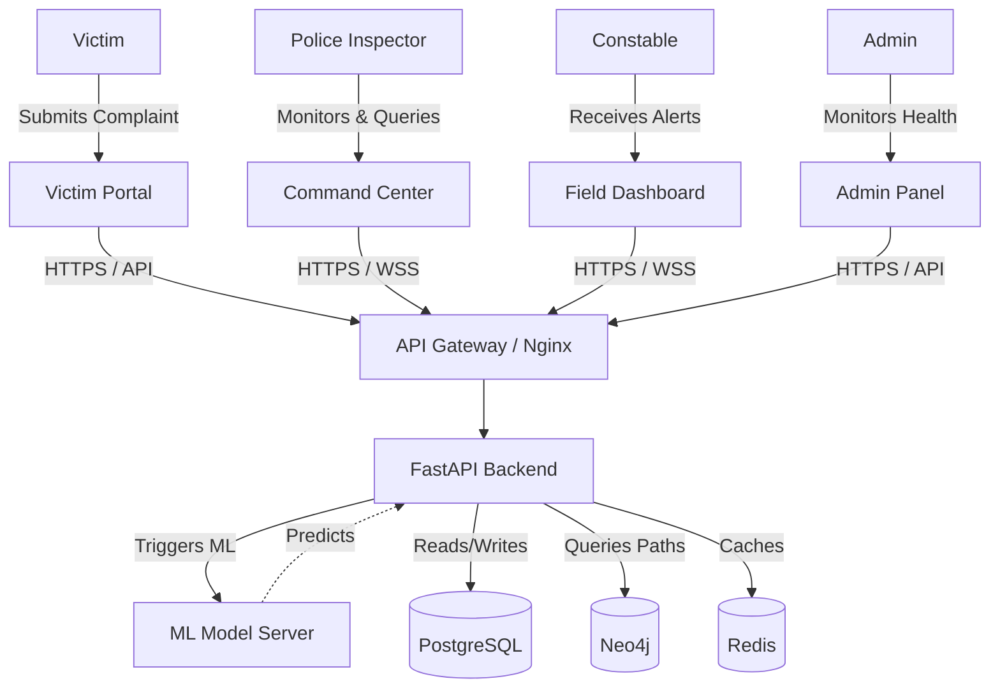
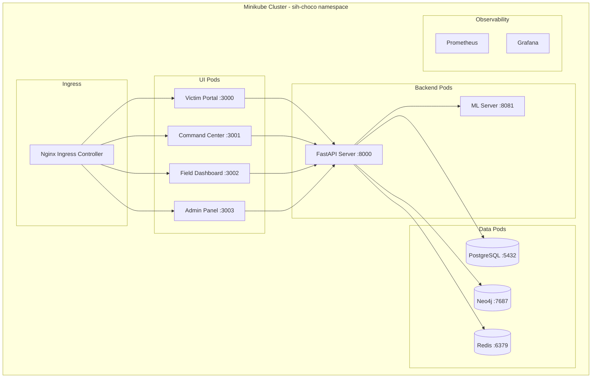
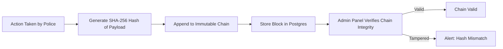

# Architecture Diagrams

> **SIH 2026 | Team CHOCO | Project ID: SIH26184**
> High-level system architecture and deployment flow.

## 1. System Context Diagram (C4 Model - Level 1)



## 2. Machine Learning Pipeline (Level 2)

```mermaid
sequenceDiagram
    participant B as Backend
    participant M as ML Server (Port 8081)
    participant T as Spatio-Temporal Model
    participant G as GNN Model
    
    B->>M: POST /predict { complaint_data }
    parallel ML Tasks
        M->>T: Predict next ATM withdrawal
        T-->>M: [ATM #452, 92% risk, 2h window]
    and
        M->>G: Score linked bank accounts
        G-->>M: [Mule1: 95%, Mule2: 40%]
    end
    M-->>B: Return aggregated intelligence
    B->>B: Save to DB & Cache
    B->>B: Broadcast via WebSocket
```

## 3. Deployment Architecture (Kubernetes / Docker)



## 4. Blockchain Audit Flow


