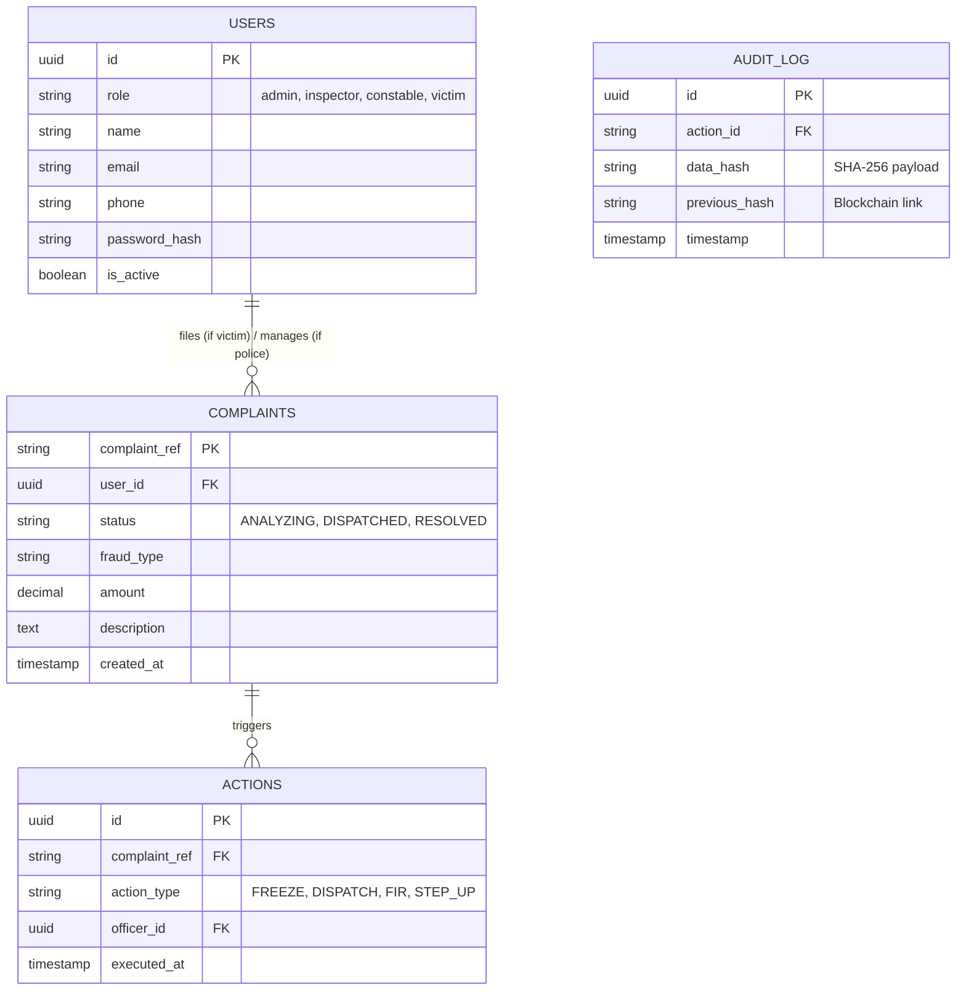

# Database & Graph Schema

> **SIH 2026 | Team CHOCO | Project ID: SIH26184**
> Schemas for PostgreSQL (Relational), Neo4j (Graph), and Redis (Cache).

## 1. PostgreSQL (Relational Data & PII)
Used for structured data, auth, complaint tracking, and blockchain hash chains.



## 2. Neo4j (Graph Data)
Used exclusively for modeling the money trail and finding mule accounts via GNNs.

### Nodes
- **`(:Victim { id, name, phone })`**
- **`(:MuleAccount { account_id, bank, mule_score, risk_level })`**
- **`(:ATM { atm_id, latitude, longitude, area, risk_score })`**
- **`(:Complaint { ref, amount })`**

### Edges (Relationships)
- **`[:SENT_MONEY_TO { amount, timestamp, method }]`** (Victim → Mule)
- **`[:TRANSFERRED_TO { amount, timestamp }]`** (Mule → Mule)
- **`[:WITHDREW_AT { amount, timestamp }]`** (Mule → ATM)
- **`[:CONNECTED_TO]`** (Complaint → Mule/ATM)

### Cypher Query Example (Risk Scoring)
```cypher
// Find ATMs frequently used by high-scoring mules connected to investment fraud
MATCH (c:Complaint {type: 'Investment'})-[:CONNECTED_TO]->(m:MuleAccount)-[:WITHDREW_AT]->(a:ATM)
WHERE m.mule_score > 70
RETURN a.atm_id, a.latitude, a.longitude, COUNT(m) as mule_traffic
ORDER BY mule_traffic DESC
```

## 3. Redis (Caching & Rate Limiting)

### Keys & TTLs
| Key Pattern | Data Type | TTL | Purpose |
|-------------|-----------|-----|---------|
| `session:{jwt_id}` | String | 4 hours | Auth token invalidation (logout) |
| `heatmap:atms:high_risk` | JSON | 5 mins | Fast retrieval for Command Center map |
| `prediction:{complaint_ref}` | JSON | 24 hours| ML output cache (fallback if ML fails) |
| `ratelimit:{ip}` | Integer | 60 secs | API abuse prevention (50 req/min limit)|

## 4. IPFS / File Storage
- Evidence files (screenshots, PDFs) are stored locally in `./uploads` (or an S3 bucket simulation).
- The SHA-256 hash of the file is stored in Postgres (`evidence` table).
- For the demo, IPFS is simulated via hashing.
